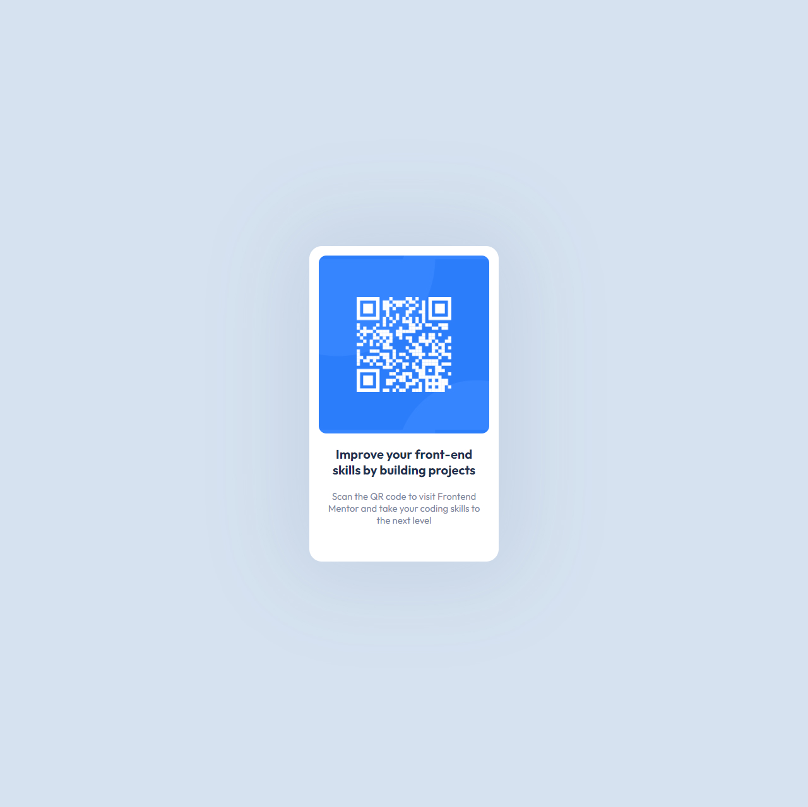

# Frontend Mentor - QR code component solution

This is a solution to the [QR code component challenge on Frontend Mentor](https://www.frontendmentor.io/challenges/qr-code-component-iux_sIO_H). Frontend Mentor challenges help you improve your coding skills by building realistic projects. 

## Overview

### Screenshot

### Link

- Live Site URL: [AAA | QR Code Challenge](https://fem-qrcodecomponent.vercel.app/)

## My process

### Built with

- Semantic HTML5 markup
- Flexbox
- Mobile-first workflow
- SASS - For styles

## Author

- Website - [Ata Abatay](https://www.ataabatay.com)
